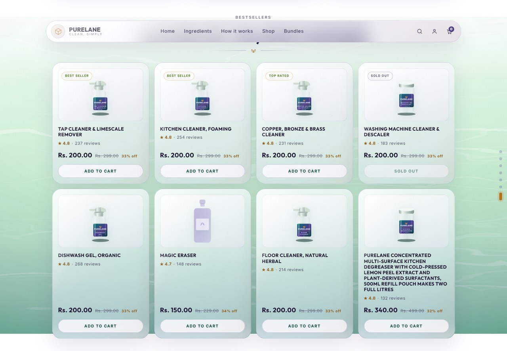
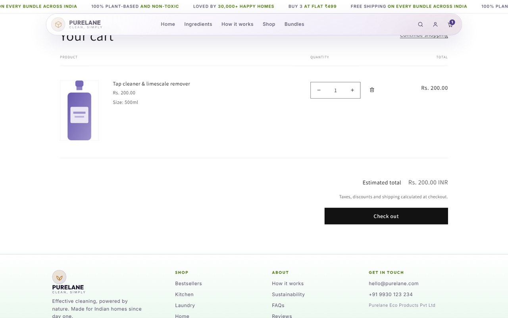

# Purelane — production Shopify sections

The `purelane-homepage.html` prototype, rebuilt as sections for stock **Dawn**.

The design is the spec and is reproduced as-is. The code is not: where the
original file was wrong for production — semantics, accessibility, performance,
theme-editor safety — it is fixed, and every fix is written up in
[docs/BUILD-NOTES.md](docs/BUILD-NOTES.md).

**Live store:** `https://amits-store-qmbc0ab3.myshopify.com` · password on request

---

## It is a working store, not a picture of one


Everything below is live Shopify data. Prices, stock, ratings and product names
come from the catalogue, not from Liquid — change a price in the admin and the
homepage changes.

### The shop grid, with real inventory states



The eight cards are deliberately not eight perfect products. The brief asked for
three edge cases and they are all in the first eight, so the grid actually
proves something:

| Card | What it demonstrates |
|---|---|
| **Washing machine cleaner & descaler** | **Sold out.** Real inventory: tracked, quantity 0, policy `deny`. The button is disabled and the pill reads `SOLD OUT`. Nothing is hardcoded — set the quantity above zero in the admin and it becomes buyable. |
| **Magic eraser** | **No image.** Falls back to a branded bottle silhouette that holds the same aspect ratio, so the row never collapses or shifts. |
| **Purelane Concentrated Multi-Surface Kitchen Degreaser…** | **A 162-character title.** It wraps and grows the row instead of overflowing, and `margin-top: auto` on the price keeps every buy button on one baseline across the row. |

### Add to cart works



Each card carries a real ``, so it posts to `/cart/add` and
works with JavaScript disabled. The screenshot above was taken by a script that
clicks the button on the homepage exactly as a customer would — not by calling
the API.

### The rest of the page

| | |
|---|---|
|  |  |
| **Best-selling combos** — a swipeable rail. Contents, savings and the `Includes:` sentence are computed from a product-list metafield. | **Bundles** — price, compare-at and the per-unit figure all derive from the real bundle product. |


**Reviews rail** — a marquee fed by `purelane_review` metaobjects, with a pause
control because WCAG 2.2.2 requires a way to stop anything that moves for more
than five seconds.

### Every section is merchant-editable


Fifteen sections in the theme editor. A marketing team adds, removes, reorders
and reconfigures them with no developer, and nothing breaks when they do —
including the animations.

---

# The brief's questions, answered

Short answers here. Each links to the full write-up.

## 1. What metafield and metaobject definitions did you create?

Only where Shopify has no native equivalent. Price, title, image, stock and URL
all come from the product object and are not duplicated.

**7 custom product fields**, namespace `purelane`:

| Field | What it's for |
|---|---|
| `badge` | The corner pill on a card — "Best seller", "Top rated" |
| `benefit` | Caption under a bottle in a combo — "Cuts grease instantly" |
| `combo_items` | **Which products are inside a combo.** Drives the artwork, the "3 products" count and the "Includes:" sentence |
| `flag` | Corner ribbon — "Most popular", "Best value" |
| `save_label` | Overrides the auto-calculated "You save ₹398" chip |
| `highlight` | Gives a combo card the gold border and solid button |
| `includes` | The "Includes:" sentence. Left blank, it writes itself from `combo_items` |

**2 standard Shopify fields**, used deliberately instead of custom ones:
`reviews.rating` and `reviews.rating_count`. Because they are Shopify's standard
keys, installing Judge.me, Loox or Okendo later fills in the star ratings with
**no code change**.

**1 metaobject — `purelane_review`**, with title, body, author, rating,
verified, linked product and context. Reviews are not products or pages, so
Shopify has nowhere to put them. This gives marketing a proper place to add one
without touching the theme.

All created over the Admin API by `tools/seed_store.py`, safe to re-run.
→ [docs/metafields.md](docs/metafields.md)

## 2. Build notes

**What I'd flag about the original file**

- It contains **two stylesheets** — a dark one and a light one overriding ~90 of
  its rules. Only the light one ever paints, so half the CSS is dead weight.
- Product names, prices and reviews are **typed into the HTML**. None of it is data.
- Two background layers share **identical SVG ids**, so one silently never draws.
- The JavaScript assumes it runs **once, on a finished page** — it breaks the
  moment a merchant reorders sections.
- The scroll handler forces the browser to recalculate layout **every frame**.
- If the script fails the page **stays blank** — everything starts at `opacity: 0`.
- Reduced-motion makes the review rail spin *faster* rather than stopping.
- The accent colour fails contrast for small text (3.48:1, needs 4.5:1).

**What I changed, and why**

- Every piece is a **Shopify section** a merchant can add, remove, reorder and
  edit — no developer.
- Products, prices, stock and ratings are **real Shopify data**, so changing a
  price in the admin changes the site.
- **One shared product card** used by every section, instead of five copies.
- Animations rebuilt to **survive the theme editor**, and to degrade safely if
  JavaScript fails.
- Fonts self-hosted, scroll handler rewritten, a blur animation dropped — speed.
- Contrast, keyboard access, focus states and reduced-motion all fixed.
- A real add-to-cart form that works with JavaScript switched off.

**What I'd do with more time**

- Wire add-to-cart into Dawn's cart drawer, so there is no page reload.
- Build the real bundle picker — "Build this box" currently links to the product.
- Automated screenshot tests at 375/768/1280, so "pixel-accurate" stays true.
- Measure real field data before claiming any Core Web Vitals number.

→ [docs/BUILD-NOTES.md](docs/BUILD-NOTES.md)

## 3. AI workflow

**What I delegated** — reading and mapping a 1,700-line file, extracting 22KB of
SVG artwork by script, generating all 16 product images from the design's own
art, and computing every contrast ratio rather than eyeballing it.

**Where it failed me**

- **It agreed with a wrong instruction.** I first asked for a flashy redesign
  with Framer Motion — which the brief forbids and Liquid cannot run.
- **Confident, invalid Liquid.** It used a filter Shopify does not have.
- **A fix that made things worse.** A CSS `@layer` fix solved one problem and
  silently created a bigger one, rendering every heading thin.
- **It reads files well, but not intent.** The design uses two styles of product
  image on purpose; I got that wrong twice before seeing the rule.

> It never fails at the interesting logic — it fails at the boring joins between
> systems. That is where the verification effort goes.

**What I'd systematise for twenty more**

- A **triage checklist** for any incoming prototype.
- A **verification script** before every push — the difference between "should
  work" and "does".
- A **debug snippet** that prints what the platform actually sees.
- **I decide the architecture, AI writes it.** Whether a combo is a product or a
  metaobject decides what a merchant can do a year from now.

→ [docs/AI-WORKFLOW.md](docs/AI-WORKFLOW.md)

---

## Repository layout

This repo holds **only the Purelane additions**, not a vendored copy of Dawn.
Every file is prefixed `purelane-`, so the diff against stock Dawn is exactly
what was written for this brief and nothing else.
`tools/install-into-dawn.sh` clones Dawn and lays these on top.

```
assets/          17  section CSS + JS, and the two woff2 subsets
  purelane-core.css      tokens, type scale, buttons, the shared card atoms
  purelane-<section>.css one per section, loaded with that section
  purelane-<name>.js     reveal, chrome, carousel, marquee, rotator, ambient

sections/        21  15 Purelane sections + Dawn's two section groups
snippets/        10  the shared pieces every section renders
templates/        1  index.json — the homepage, generated by tools/build_index.py

docs/             5  the written deliverables
  BUILD-NOTES.md         what was wrong with the prototype, what changed, why
  AI-WORKFLOW.md         what was delegated, where it failed, what to systematise
  metafields.md          every metafield and metaobject definition to create
  SETUP.md               Partner account -> published theme, ~45 minutes
  purelane-homepage.html the original prototype — the spec, and an input
  screenshots/           the images this README embeds

tools/           14  everything needed to rebuild the store from scratch
  install-into-dawn.sh   clone Dawn, copy these files, patch theme.liquid
  seed-products.csv      16 products including the three required edge cases
  seed_store.py          metafield + metaobject definitions and values
  seed_ratings.py        standard reviews.rating metafields
  fix_inventory.py       tracking, policy and quantity (the CSV importer drops these)
  publish_online_store.py  publish products to the Online Store channel
  extract_product_art.py   flat silhouettes, decoded from the prototype's SVGs
  make_labelled_art.py     labelled bottles, from its two finished templates
  replace_product_art.py   upload both sets per product, in order
  build_index.py         regenerate templates/index.json
  verify.py              the pre-push check — see Verifying, below
  preview.py / shoot.py  render the sections locally, without a store
  shots.py               regenerate this README's screenshots
```

Not tracked: `tools/seed-images/` and `tools/preview/` are generated output
(40MB) and are rebuilt by the scripts above.

The prototype lives in `docs/` rather than alongside as a download, because it
is not only reference — `extract_product_art.py` decodes the product artwork
straight out of it. A fresh clone regenerates everything with nothing else on
disk.

## The five required sections

| # | Section | File | Prototype |
|---|---|---|---|
| 01 | Hero | `sections/purelane-hero.liquid` | `section.hero` |
| 02 | Shop / product grid | `sections/purelane-product-grid.liquid` | `#shop` |
| 03 | Best-selling combos | `sections/purelane-combos.liquid` | `#combos` |
| 04 | Bundles | `sections/purelane-bundles.liquid` | `#bundles` |
| 05 | Reviews rail | `sections/purelane-reviews.liquid` | `#reviews` |

Ten more were built as bonus: ingredients, pillars, proof + rotator, full range,
why-bundles, categories, trust bar, signup, and the ticker / header / progress
rail / sticky CTA / footer chrome.

Plus `sections/purelane-ambient.liquid` — the fixed mint backdrop with the
caustics and bubbles. It sits behind everything, so it belongs to no single
section and is added once per template. Every content section works whether or
not it is present.

## Shared code

Several sections render the same objects, so they render the same snippets.

```
snippets/
  purelane-head.liquid            fonts + core CSS, rendered once from theme.liquid
  purelane-assets.liquid          the reveal script, rendered by every section
  purelane-product-card.liquid    the card in the shop grid
  purelane-product-image.liquid   responsive , or a branded placeholder
  purelane-price.liquid           price / compare-at / computed saving
  purelane-rating.liquid          standard reviews.* metafields, with real SR text
  purelane-review-card.liquid     one quote in the marquee
  purelane-icon.liquid            the five icons, defined once instead of 40+ times
  purelane-water.liquid           caustic layers, ids namespaced per section
```

## Data

Nothing that reads as copy or catalogue is hardcoded. Prices, titles, images and
availability come from products; reviews come from a `purelane_review`
metaobject; the rest are section settings and blocks.

Ratings use Shopify's **standard** `reviews.rating` definitions rather than
custom ones, so installing Judge.me, Okendo, Loox or Yotpo populates the stars
with no theme change.

Definitions: [docs/metafields.md](docs/metafields.md).

## The one Dawn file this touches

`layout/theme.liquid` gains a single line after Dawn's `base.css`:

```liquid

```

Fonts and design tokens have to be emitted **once**, in the head, after Dawn.
Everything else is additive and prefixed `purelane-`, so no stock file is
overwritten. `tools/install-into-dawn.sh` applies the patch idempotently.
The reasoning — including the `@layer` approach that made things worse before
this replaced it — is in [docs/BUILD-NOTES.md](docs/BUILD-NOTES.md).

## Getting it running

[docs/SETUP.md](docs/SETUP.md) — Partner account through to a published theme,
about 45 minutes, all free.

```bash
bash tools/install-into-dawn.sh ../purelane-store   # clone Dawn, lay this on top
# tools/seed-products.csv                           # 16 products, 3 edge cases

export SHOPIFY_STORE=your-store.myshopify.com
export SHOPIFY_TOKEN=shpat_...

python tools/seed_store.py            # metafield + metaobject definitions, values
python tools/extract_product_art.py   # flat silhouettes, from the prototype's SVGs
python tools/make_labelled_art.py     # labelled bottles, from its finished templates
python tools/replace_product_art.py   # upload both per product
python tools/seed_ratings.py          # standard reviews.* metafields
python tools/fix_inventory.py         # tracking, policy and quantity from the CSV
```

`fix_inventory.py` is not optional: Shopify's CSV importer silently drops the
inventory tracker column, so every variant lands untracked and the seeded
quantities are decorative until this runs.

## Reading the notes

- [docs/BUILD-NOTES.md](docs/BUILD-NOTES.md) — what I'd flag about the original,
  what changed and why, what I'd do with more time
- [docs/AI-WORKFLOW.md](docs/AI-WORKFLOW.md) — what I delegated, where it failed
  me, what I'd systematise for twenty more of these
- [docs/metafields.md](docs/metafields.md) — every definition to create
- [docs/SETUP.md](docs/SETUP.md) — store setup and the QA checklist

## Seeing it without a store

Liquid does not open in a browser. This renders the real section files with the
Shopify objects shimmed and the seed catalogue loaded, then screenshots the
result at every breakpoint the design cares about:

```bash
pip install python-liquid playwright && playwright install chromium
python tools/preview.py --open        # -> tools/preview/index.html
python tools/shoot.py                 # -> tools/preview/shots/*.png
```

It is a preview, not an emulator — Shopify's renderer is the authority, and
cart, routing and the image CDN are not reproduced. It exists to catch layout
and Liquid mistakes before they reach a store, and it earned its keep: three of
the findings in the build notes came out of it and out of nothing else.
 is claimed.
